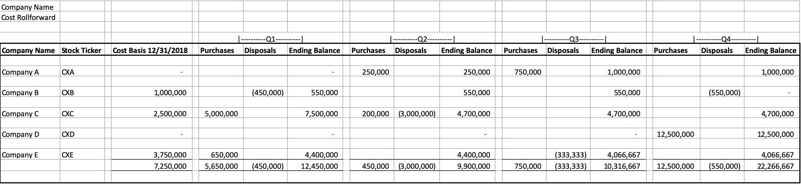
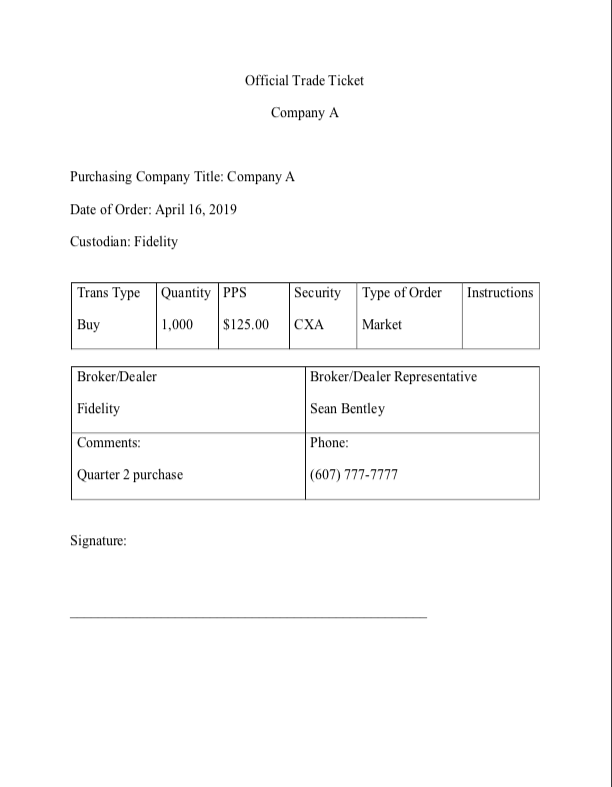
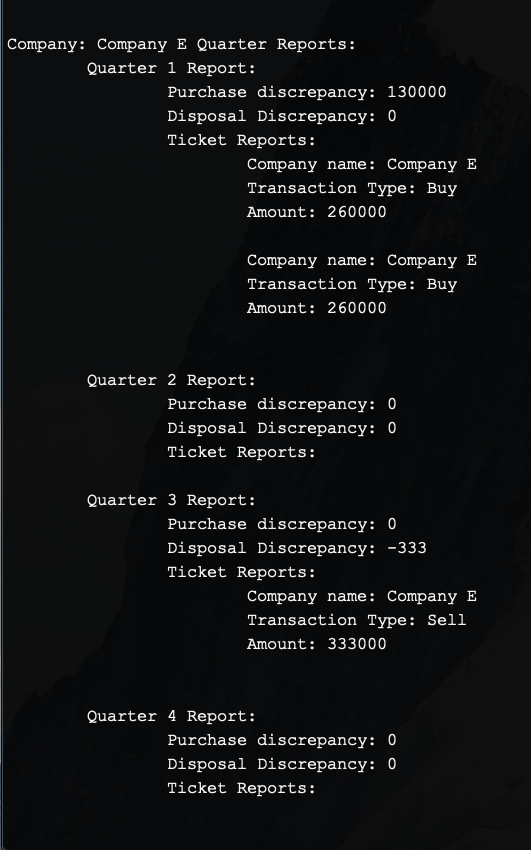
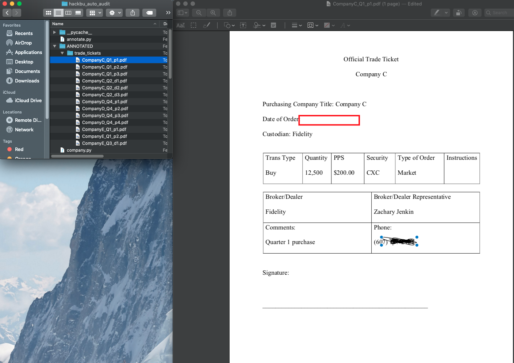

# hackbu_auto_audit
Auto auditing tool for validating expense reports to assist entry level accountants at large accounting firms

author: Alex Kennedy

<h3> Description of the task:</h3>

 
  Every year, the undesirable task of verifying expense reports consumes a massive amount of time. Although the format may change slightly from firm to firm, the task in essence boils down to this: 
  <ol>
    <li> The "cost roll file" - usually an excel spreadsheet. It holds quantitative information about the stocks the parent company either bought or sold by quarter for a fiscal year. Here's the example for our demo </li>
    <li> For every purchase or disposal of stock there should be a trade ticket. A trade ticket is a uniform file which specifies information about each trade. Our demo uses very many. Here's an example. </li>
    <li> All data from the trade tickets must match the information in the cost roll file. For example, all trade tickets for Company A of type "Buy" with transaction dates in the first quarter should have a total sum equal to Company A's purchases in the cost roll file. Otherwise, we have a discrepency.</li>
    <li> Finally, all trade tickets must be well-formed, without any missing information. </li>
  </ol>
  <b>Fun stuff right? This task is done by hand, with the accountant manually looking through each trade ticket.</b>

<h3> What This Program Does:</h3>
<ol>
  <li> Reports all discrepencies for each traded company in a modular format by comparing the information as described above. Here's what a piece of the output looks like when there's a discrepency:  </li>
  <li>Detects missing information in any trade ticket, automatically annotates its pdf with a red box around whatever is missing, and saves it in an ANNOTATED folder. Here's what it looks like: </li>
</ol>
